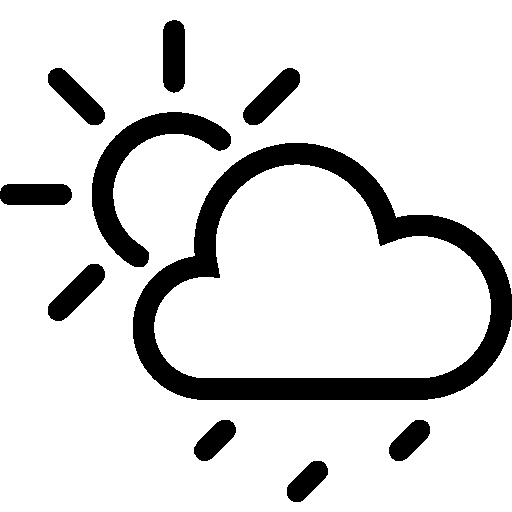

<!-- PROJECT LOGO -->
<br />
<p align="center">
  
  <h3 align="center">Weather app</h3>
     <br />
    <br />
</p>


<!-- TABLE OF CONTENTS -->
<details open="open">
  <summary>Table of Contents</summary>
  <ol>
    <li>
      <a href="#about-the-project">About The Project</a>
    </li>
    <li><a href="#installation">Installation</a></li>
    <li><a href="#usage">Usage</a></li>
    <li><a href="#acknowledgements">Acknowledgements</a></li>
  </ol>
</details>


<!-- ABOUT THE PROJECT -->
## About The Project

A simple weather app created with python. The application is made to be able to search for any city and get a weather report from this city. First the application finds the city's longitude and latitude with help from href="https://geopy.readthedocs.io/en/stable/">GeoPy/a>. Then gets the weather data from an API key from href="https://openweathermap.org/">OpenWeatherMap/a>. Lastly the app takes the data from the API and gives a weather report. 

  

I started this project with the aim of becoming more familiar with API keys and how to get and use the data from one. During the project I had to find longitude and latitude from a city. The solution was GeoPy and I then also got to learn a little about geocoding. After the project I will say that the project was both interesting, enjoyable and I am happy with the result. 


<!-- Installation -->
### Installation

To run this application, install with git clone

   ```sh
   git clone https://github.com/jacobsvennevik/Weather.git
   ```

<!-- USAGE EXAMPLES -->
## Usage


After installation open the file in an editor, then use the run function. 


![Usage run screenshot][usagesRun]

The weather report wil be shown in your code runner.

![Usage result screenshot][usagesResult]


<!-- ACKNOWLEDGEMENTS -->
## Acknowledgements
* [OpenWeatherMap](https://openweathermap.org/)
* [GeoPy](https://geopy.readthedocs.io/en/stable/)


<!-- IMAGES -->
[usagesRun]: images/usagesRun.png
[usagesResult]: images/usagesResult.png


